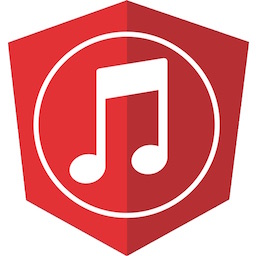

# ngTunes

ngTunes is a music visualization application written using angular 2. 
Users can search Spotify for tracks to customize a playlist to sample 
their favorite tunes. While listening and viewing their playlist users 
can also tweet about what they're rocking as well as set what others 
are enjoying.

[Listen to music now!](http://www.angulartunes.com)

## Contribute!

Want to make ngTunes better?
Submit a Pull Request. Take a look at the [TODO List](#todo-list) for ideas on what to play around with.

Contributions will be reviewed by a core community team and end up on the live audio player at [angulartunes.com](http://www.angulartunes.com).

## TODO List

- [ ] Plug/play visualizers
- [ ] Allow playlists to be shared via AngularFire2 integration
- [ ] Make playlist loop through all tracks instead of repeat the same one over and over
- [ ] Create a NativeScript app of the player
- [ ] Allow more customizations to visualizers
- [ ] Create standalone plugin widget of just the Spotify search
- [ ] Fix bug with removing tracks

## Overview

A mashup of many technologies were used to bring this experience to users. 
The project was scaffolded up using the angular CLI and utilized to build 
the application. The visualization engine is a port of audiograph which 
was brought in as it's own angular 2 component. The music catalog takes 
advantage of Spotify's API for searching and track playback. Twitter's 
API was used for both the ability to retrieve related tweets via live 
stream and for posting to the user's timeline if they choose to share. 
(Add screenshot info if we get that working too)

Credits and libs used:

* [Angular CLI](https://cli.angular.io/)
* [Infowrap](http://www.infowrap.com/2159/overview?token=5c3064c7-4bab-455c-b133-c5bbaee31f0f)
  * productivity tool to keep everyone on same page
  * Files area contains animated gifs of some progress along the way
* [angulartics2](https://github.com/angulartics/angulartics2)
* [@ngrx/store](https://github.com/ngrx/store)
* [pusher-js](https://github.com/pusher/pusher-js)
* [three.js](http://threejs.org/)
* [audiograph.xyz](https://github.com/mattdesl/audiograph.xyz)
  * Huge thanks to [Matt DesLauriers](https://github.com/mattdesl) for permission to customize his sweet visualizer!
* [angular2-color-picker](https://github.com/Alberplz/angular2-color-picker)
* [Spotify web api](https://developer.spotify.com/web-api/)
* [Twitter api](https://dev.twitter.com/rest/public)
* [Font Awesome](http://fontawesome.io/)
* [hint.css](http://kushagragour.in/lab/hint/)
* [Bootstrap](http://getbootstrap.com/)

[Angular Attack](https://www.angularattack.com/entries/all) 2016 submission. [View Original Entry](https://www.angularattack.com/entries/1393-48angles).

The founding team:
- The dreamer - Nathan Walker ([@wwwalkerrun](http://twitter.com/wwwalkerrun))
- The work horse - James Churchill ([@SmashDev](http://twitter.com/SmashDev))
- The energy - Sean Larkin ([@TheLarkInn](http://twitter.com/TheLarkInn))
- The other guy - Mike Brocchi ([@brocco](http://twitter.com/brocco))

## License

MIT
